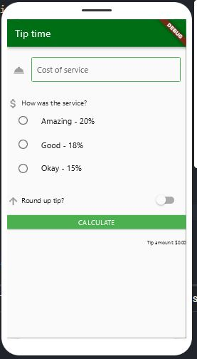

## tip_time
App para calcular propinas dependiendo del costo del servicio, para su creación se utilizó:
- Interacción del usuario 
- Estados
- Botones
- Formateo de strings
- Text Fields
- Radio group
- Primary color
- Providers
# Lo que me costó más trabajo
Tuve muchas dificultades con las radio tiles, tanto para hacer que se comunicaran con el provider (lo cual si pude resolver) y para que cambiaran su color cuando fueran seleccionadas (eso no lo pude resolver).
Además el layout no quedó exactamente igual pero creo que hice ajustes para quedara lo más similar que se pudiera con mi nivel de habilidad
# Lo que aprendí
- A utilizar providers en luga de set states
- A usar Switches y RadioListTiles
- A organizar estos elementos en la página para se vean ordenados y presentables
# App Screenshot

# Link a video funcionando
https://www.youtube.com/shorts/SL_6MLS4A-8
